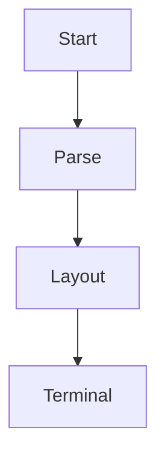

# Markdown showcase

This document exercises **strong**, *emphasis*, ***both***, __standard strong__,
~~deleted~~, ==highlighted==, ++inserted++, and ||visible spoiler|| text.

## Headings and paragraphs

Setext heading
--------------

### Third level
#### Fourth level
##### Fifth level
###### Sixth level

These source lines
form one paragraph. This is a hard break:  
The next line stays separate.

Escapes: \*literal stars\*, a_b_c, &amp;, &lt;, and `code_with_*punctuation*`.
Inline code retains `two  spaces`. Unicode: café, é, 日本語, 👩‍💻, and :smile:.

---

## Lists and nesting

3. Start numbering at three.
4. Continue with a nested list:
   - A child item with **formatting**.
     - A deeper item that wraps while retaining its hanging indentation.

- [x] A completed task
- [ ] An incomplete task

> A quoted paragraph.
>
> 1. Lists can appear inside quotes.
> 2. And code can appear inside lists:
>
>    ```rust
>    let literal_name = "**not emphasis**";
>    ```

> [!NOTE]
> Notes are visible text callouts.

> [!TIP]
> Try narrowing the terminal to exercise wrapping.

> [!IMPORTANT]
> Code whitespace and punctuation must be preserved.

> [!WARNING]
> Wide tables become labelled records when necessary.

> [!CAUTION]
> Text in a document cannot execute terminal commands.

>>>
This is a multiline quote.

It contains two paragraphs.
>>>

## Code and diagrams

```rust
fn main() {
    let file_name = "a_b*c.md";
    println!("{}", file_name);
}
```

~~~text
A deliberately long code line: 0123456789ABCDEFGHIJKLMNOPQRSTUVWXYZabcdefghijklmnopqrstuvwxyz0123456789ABCDEFGHIJKLMNOPQRSTUVWXYZ
~~~

    Indented code has **literal** Markdown.
        Deeper indentation is retained.



## Tables

| Item | Quantity | Status |
| :--- | ---: | :---: |
| **Apples** | 7 | [x] |
| Pears with a long descriptive name | 120 | [ ] |
| Inline `a_b` and an escaped \| pipe | 3 | Ready |

| A | B | C | D | E | F |
| --- | --- | --- | --- | --- | --- |
| red | green | blue | gold | white | black |

## Links, images, and footnotes

[Example](https://example.com) and [the same destination][example] share one link reference.
Automatic links: https://example.org and <reader@example.com>.
An unresolved reference stays readable: [missing][undefined].
A wiki link: [[notes/rendering|Rendering notes]].


A normal footnote[^detail] and an inline note^[Inline notes use the same footnote sequence.].

[example]: https://example.com "Example title"
[^detail]: Footnotes can contain **formatting**, paragraphs, and links to [a reference](https://example.net).

## Definitions and math

Renderer

: Converts parsed document structure to terminal text.

Layout

: Wraps and aligns content within a pane.

Superscript: x^2^ and superscript^word^. Subscript: H~2~O.

Inline math: $x_1 + x_2 = y$.

$$
y = ax^2 + bx + c
$$

```math
\sum_{i=1}^{n} i = \frac{n(n+1)}{2}
```

## Embedded HTML

<details>
<summary>Expanded details</summary>
<p>HTML <strong>strong</strong>, <em>emphasis</em>, <u>underline</u>, <del>deleted</del>, and <mark>highlighted</mark> text.</p>
<p>Keyboard: <kbd>Esc</kbd>. Line break:<br>second line. H<sub>2</sub>O and x<sup>2</sup>.</p>
<table>
<caption>HTML table</caption>
<tr><th>Name</th><th>Value</th></tr>
<tr><td>HTML content</td><td>also wraps</td></tr>
</table>
</details>

<script>throw new Error('This is not executed or displayed');</script>
<style>body { color: red; }</style>
